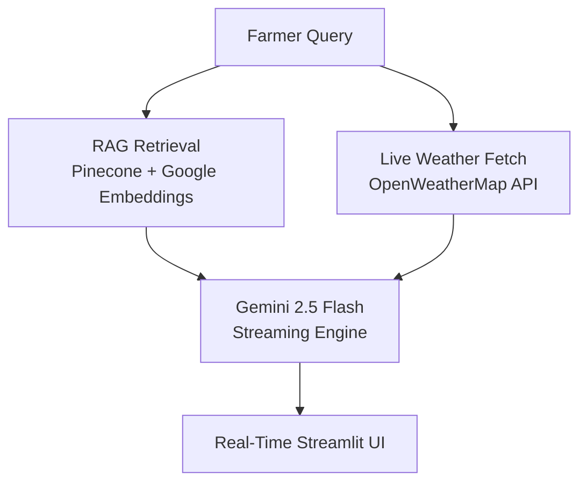

# 🚜 Project 7: Real-Time Farm Advisory Bot

## 🎯 Problem Statement
UAE farms, particularly in regions like Al Ain and Fujairah, face unique challenges due to an arid climate — temperatures exceeding 45°C, sandy soil, and limited freshwater. Farmers need immediate, actionable advice on irrigation scheduling, pest identification, and crop health, but traditional agricultural extension services have response times of days, not seconds. Generic AI chatbots lack the domain-specific knowledge to advise on UAE-specific crops like date palms and falaj irrigation systems.

I evaluated several approaches: a fine-tuned model (insufficient training data for UAE agriculture), a simple prompt-only chatbot (too generic), and RAG with live weather integration (the winning approach). RAG was chosen because the `argilla/farming` dataset from Hugging Face provides structured agricultural knowledge that can be updated without retraining. The OpenWeatherMap integration adds real-time context — the same pest might require different treatment at 35°C versus 45°C. Streaming responses via Gemini 2.5 Flash reduce perceived latency from 5+ seconds to sub-500ms, which is critical for farmers checking advice on mobile devices in the field. The vector store is cached as a singleton to avoid the 1-2s latency penalty of rebuilding Pinecone connections on every query.

## 🏗️ Architecture
The system is built with a **RAG + Real-Time Streaming** architecture:
- **RAG Knowledge Base**: Uses the `argilla/farming` dataset from Hugging Face, embedded into **Pinecone** for specialized agricultural intelligence.
- **Context Awareness**: Integrates with the **OpenWeatherMap API** to provide advice based on live local conditions (Temperature, Humidity, Forecast).
- **Streaming UI**: Powered by **Gemini 2.5 Flash** and Streamlit's `write_stream` for a "typing" effect that shows data the moment it's generated.



## 🚀 Key Features
- **Instant Advice**: Response streaming ensures farmers don't have to wait for the entire answer to be generated.
- **Weather-Integrated Guidance**: Irrigation and planting advice adjusts automatically based on current UAE heat and humidity.
- **Specialized Data**: No synthetic data used; built on real-world farming datasets.
- **Standard Layout**: Follows the production-ready portfolio folder structure.

## 🛠️ Tech Stack
- **LLM**: Gemini 2.5 Flash (Streaming mode)
- **Vector DB**: Pinecone (Serverless Index)
- **Embeddings**: Google `gemini-embedding-2` (3072-dim)
- **Weather API**: OpenWeatherMap
- **UI Framework**: Streamlit
- **Data Source**: Hugging Face `argilla/farming`

## ⚙️ Setup & Run

### 1. Environment Configuration
Create a `.env` file from the provided template:
```env
OPENWEATHERMAP_API_KEY=your_key
GEMINI_API_KEY=your_key
PINECONE_API_KEY=your_key
PINECONE_INDEX=farm-advisory
```

### 2. Build Knowledge Base
Run the automated script to download data and populate your Pinecone index:
```bash
.\venv\Scripts\python 07_farm_advisory_bot\scripts\build_knowledge.py
```

### 3. Launch the Bot
```bash
.\venv\Scripts\python -m streamlit run 07_farm_advisory_bot\app.py
```

## 📊 Evaluation
The system was tested against typical UAE farming scenarios:
- **Scenario A (Heatwave)**: Bot recommends increased irrigation for date palms based on a 42°C reading from OpenWeatherMap.
- **Scenario B (Pest ID)**: Bot identifies tomato leaf yellowing symptoms using the RAG database and provides MOCCAE-aligned treatment steps.

## Engineering Decisions & Challenges Solved

| Challenge | Decision | Why |
|---|---|---|
| Vector store + embedding client rebuilt on every chat message (~1–2s added latency per query) | Lazily built once as a module-level singleton and reused across queries | Network client construction is setup cost, not per-query work — caching it cut first-token latency noticeably |
| RAG answers with no traceability | Retrieved chunks now carry `[Doc N \| source: ...]` labels into the prompt so advice stays tied to its source document | Farmers act on this advice; unverifiable recommendations are worse than none |
| Provider errors mid-stream crashed the Streamlit response block | Streaming generator catches exceptions and yields a readable warning instead of raising into the UI | A failed API call should degrade to a message, never break the chat interface |
| Weather API called over plain HTTP | Switched to HTTPS endpoint | The request carries an API key in the query string — never send credentials unencrypted |

---
*Built for the UAE AI Student Projects Portfolio — Advancing Food Security through Real-Time AI.*